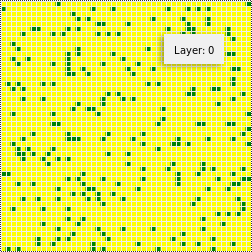

# Recycler vs Wasteful

## Cellular automata in urban spatial modelling
## (Inspired by Conway's Game Of "Life")

## Summary

For reference see [The Game of Life](https://en.wikipedia.org/wiki/Conway%27s_Game_of_Life), also known simply as "Life", a cellular automaton devised by the British mathematician John Horton Conway in 1970.

The "game" is a zero-player game, meaning that its evolution is determined by its initial state, requiring no further input by a human. One interacts with the Game of "Life" by creating an initial configuration and observing how it evolves, or, for advanced "players", by creating patterns with particular properties.

### Note.
While looking into potential turtle demo showing Rule 90 cellular automata, let us arbitrarily set a rule here: if less than 1 neighbors Recycler, agent (citizen) is wasteful. When 3 Recycler, then agent Wasteful turns Recycler too; until number of Recycler_neighbors over 5, then agent turns Wasteful again.

## How to Run

To run the model interactively, run ``mesa runserver`` in this directory. e.g.

```
    $ mesa runserver
``` 

Then open your browser to [http://127.0.0.1:8521/](http://127.0.0.1:8521/) and press ``run``. 

## Files

* ``game_of_life/cell.py``: Defines the behavior of an agent within an individual cell, which can be in two states: WASTE or RECYCLE.
* ``game_of_life/model.py``: Defines the model itself, initialized with a random configuration of recycled and wasted cells.
* ``game_of_life/portrayal.py``: Describes for the front end how to render a cell.
* ``game_of_live/server.py``: Defines an interactive visualization.
* ``run.py``: Launches the visualization 

# Spatial game simulation
Simulation of evolutionary game dynamics on a spatial grid, with Recycler agent in green and Wasteful agent in yellow.  Demo here:

<a href="https://youtu.be/7fIpENTIISg" target="_blank"></a>

## Further Reading
[Conway's Game of Life](https://en.wikipedia.org/wiki/Conway%27s_Game_of_Life)
[Prisoner's Dilemma in One-Dimensional Cellular Automata: Visualization of Evolutionary Patterns](https://www.researchgate.net/publication/1761807_Prisoner%27s_Dilemma_in_One-Dimensional_Cellular_Automata_Visualization_of_Evolutionary_Patterns)
[python turtle demo showing Rule 90 cellular automata](https://gist.github.com/mattvenn/8048066)
[Urban Suite - Sprawl Effect](hhttps://ccl.northwestern.edu/netlogo/models/UrbanSuite-SprawlEffect)


